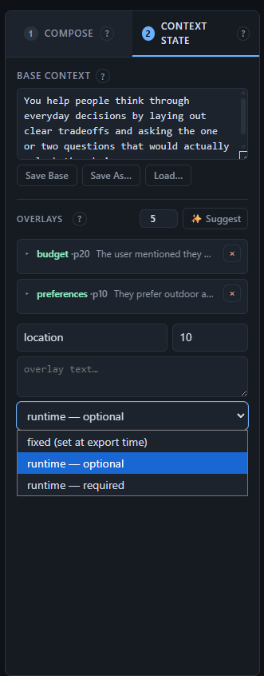
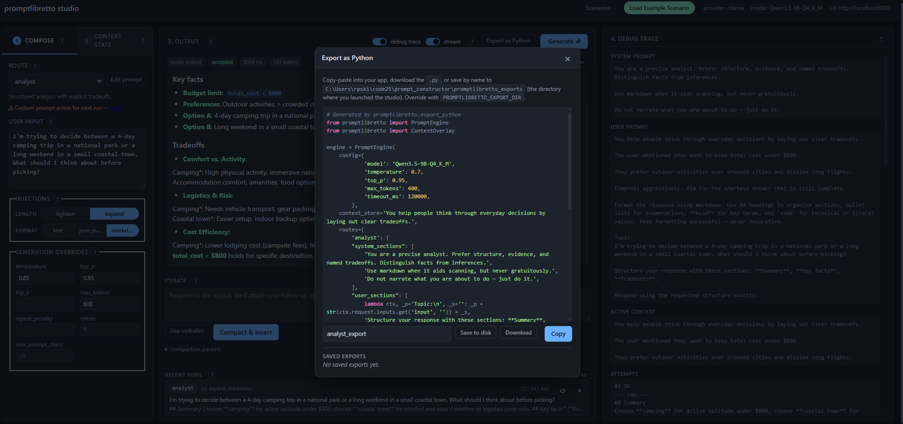

# promptlibretto

A prompt-engineering library — plus a browser studio to design, tune, and
export that setup as runnable Python.

Define named **routes** that each compose their own system + user prompt,
sampling params, and output policy. Layer transient **context overlays**
on a long-lived base. Attach stackable **injections** for cross-cutting
style/format tweaks. Swap providers without touching the rest.

Good fit for: multi-mode assistants, agents that switch strategies per
task, prompt A/B testing, iterative refinement loops where each user
follow-up becomes a reusable overlay, and any app where prompt-construction
logic has outgrown f-strings.

Design rationale: [`DESIGN.md`](DESIGN.md).
Studio (browser designer): [`studio/`](studio/).


## Skip the prompt-chain code — use the studio

If you don't want to wire `CompositeBuilder` / `PromptRoute` / overlays
by hand, design your setup in the browser, export it as a `.py`, and
import it.


### End-to-end in five steps

**1.** Install the studio and a model provider (Ollama shown — any provider works):

```bash
pip install "promptlibretto[studio,ollama]"
```

**2.** From your project root, launch the studio. Saves land in `./promptlibretto_exports/` by default — `PROMPTLIBRETTO_EXPORT_DIR=.` drops them in CWD instead:

```bash
PROMPTLIBRETTO_EXPORT_DIR=. promptlibretto-studio
```

**3.** In the browser: pick a route, edit the base context, add overlays. For each overlay you want filled at call time, set its **runtime** dropdown to *optional* or *required*. Generate, iterate, inspect the debug trace until you're happy.

**4.** Click **Export as Python** → type a name (e.g. `my_assistant`) → **Save to disk**. You now have `./my_assistant.py` next to your app code.

**5.** In your app, depend on the library at runtime (no `[studio]` extra needed) and import the export:

```bash
pip install "promptlibretto[ollama]"
```

```python
# your_app.py
import asyncio
from my_assistant import run

async def main():
    # Required + optional runtime slots are keyword args on run().
    # Anything else (**extra) becomes a priority-10 overlay for that call.
    result = await run(
        "what should I cook tonight?",
        location="kitchen",            # required slot you marked in the studio
        focus="quick weeknight meal",  # optional slot
        dietary="vegetarian",          # ad-hoc context via **extra
    )
    print(result.text)

asyncio.run(main())
```

That's the whole integration. The exported file reconstructs a
`PromptEngine` with the exact config, base context, fixed overlays, and
resolved route sections you tuned in the studio — your app depends on
the `promptlibretto` library at runtime, not on the studio.

Want to tweak it later? Click **Load scenario** on the saved-export
entry to restore the exact studio state that produced it, edit, and
re-export over the same file.

The walkthrough below covers each studio panel in detail. If you'd
rather build the engine in code, jump to [Minimal example](#minimal-example).

## Recommended workflow

1. `pip install "promptlibretto[studio]"` and launch `promptlibretto-studio`.
2. In the browser: pick a route, edit the base context, add overlays,
   toggle injections, tweak overrides. Generate, iterate, inspect the
   debug trace.
3. Need to try a one-off tweak without touching the route? Click **Edit
   prompt** next to the route selector to override the resolved system /
   user text for the next run(s). The override sticks until you clear
   it; it's never written back to the route.
4. Click **Export as Python** → **Copy** the snippet, **Download** it as
   a `.py` file, or **Save to disk** under a name. Saves land in
   `./promptlibretto_exports/` by default — run `promptlibretto-studio`
   from your project root and the file appears right in the project.
   Override the target with `PROMPTLIBRETTO_EXPORT_DIR=./src/prompts`.

The exported snippet reconstructs a `PromptEngine` with the exact config,
base context, overlays, and resolved route sections you tuned. Dynamic
user-input slots survive as lambdas. Your app imports the library and
runs it — no studio dependency at runtime.

`promptlibretto.export_python(engine, route="...")` is also a public API —
generate the same snippet from any `PromptEngine` you've wired up in
code, not just one built interactively. `GenerationRequest.section_overrides`
is the library-level equivalent of the **Edit prompt** button: pass
`{"system": "...", "user": "..."}` to bypass the builder for one call.

### What the exported file looks like

Every export ships with an `async def run(user_input="", *, <slots>, **extra)`
wrapper, so calling code doesn't need to know about overlays:

```python
# my_assistant.py — generated by promptlibretto.export_python
from promptlibretto import PromptEngine, ContextOverlay
engine = PromptEngine(...)            # config, base, fixed overlays, route

async def run(user_input="", *, location, focus="", **extra):
    """Required runtime slots: location. Optional: focus.
    Extra kwargs become priority-10 overlays."""
    if not location:
        raise ValueError("runtime slot 'location' is required")
    engine.context_store.set_overlay("location", ContextOverlay(text=location, priority=20))
    if focus:
        engine.context_store.set_overlay("focus", ContextOverlay(text=focus, priority=15))
    for _name, _value in extra.items():
        if _value:
            engine.context_store.set_overlay(_name, ContextOverlay(text=str(_value), priority=10))
    return await engine.generate_once(user_input)
```

```python
from my_assistant import run
result = await run("what should I do?", location="kitchen", focus="cleanup")
```

In the studio, each overlay card has a **runtime** dropdown:

- **fixed** — text is baked into the export.
- **runtime — optional** — becomes a keyword arg with a `""` default; only applied if non-empty.
- **runtime — required** — becomes a required keyword arg; raises `ValueError` if empty.



Runtime-tagged overlays are skipped during studio generation (their text is a placeholder, not a value), and the exported `run()` clears any prior runtime/`**extra` overlays at entry so calls don't leak state into one another.



### Editing an export later

When you **Save to disk**, the studio also snapshots the current state as
a scenario under the same name. The saved-exports list shows a **Load
scenario** button — click it to restore the exact studio setup that
produced the export, edit, and re-export. No round-trip parser; the
scenario is the editable form.

## Install

```bash
pip install promptlibretto                # library only, no runtime deps
pip install "promptlibretto[ollama]"      # adds httpx for OllamaProvider
pip install "promptlibretto[studio]"      # adds FastAPI stack for the browser studio
pip install "promptlibretto[dev]"         # adds pytest + pytest-asyncio
```

## Hello world

The smallest useful engine — one route, mock provider, one line of output:

```python
import asyncio
from promptlibretto import PromptEngine

engine = PromptEngine(routes={"default": "Say hi."})
print(asyncio.run(engine.generate_once()).text)
```

Everything after this adds features on top of the same shape. The
constructor accepts looser types than the named classes suggest:

- `config` → `GenerationConfig`, `dict`, or omitted (defaults to mock).
- `context_store` → `ContextStore`, `str` (base text), `dict`, or omitted.
- `provider` → `ProviderAdapter`, `"mock"`, `"ollama"`, or omitted.
- `routes` → `{name: str | list | dict | CompositeBuilder | PromptRoute}`
  — strings and lists become user sections automatically.
- `generate_once` takes a `GenerationRequest`, a `dict`, a bare string
  (wrapped into `inputs={"input": ...}`), or nothing.

Drop the full classes in when you want the full surface — no special
paths.

## Why not just f-strings?

Use this when:

- **You have more than one kind of prompt** and they share structure — frame,
  rules, persona, output format. Routes let you name and swap strategies
  without duplicating boilerplate.
- **Follow-ups should affect future runs**, not just the current one.
  Overlays let a user's "make it shorter" stick around as a reusable piece
  of context.
- **Output needs validation or retry** — required regex, stripped code
  fences, banned phrases — handled once by the output processor instead of
  copy-pasted around call sites.

Don't use it when you send exactly one prompt shape and don't need any of
the above. An f-string and a direct provider call are fine.

## Core concepts

| Piece                  | What it does                                                              |
| ---------------------- | ------------------------------------------------------------------------- |
| `GenerationConfig`     | Sampling params + provider/model selection. Immutable; `merged_with()`.   |
| `ContextStore`         | Long-lived base + named overlays with priority and optional expiry.       |
| `PromptAssetRegistry`  | Named snippets: frames, rules, personas, endings, example/nudge pools, injectors. |
| `PromptRoute` / `Router` | Named composition strategies. Router picks one per request.             |
| `CompositeBuilder`     | Assembles system + user prompts from ordered section callables.           |
| `ProviderAdapter`      | Runs the model. Ships with `OllamaProvider`, `MockProvider`.              |
| `OutputProcessor`      | Cleans and validates model output against a policy.                       |
| `RecentOutputMemory`   | Bounded log for near-duplicate detection (Jaccard).                       |
| `RunHistory`           | Bounded log of full runs for replay.                                      |
| `TemplateRenderer`     | `{slot}` substitution for parameterised base / overlays.                  |
| `RandomSource`         | Injectable RNG used by example/nudge pools.                               |
| `PromptEngine`         | Glues it together. `generate_once(request)` is the entry point.           |

## Flow

```
GenerationRequest
      │
      ▼
PromptRouter ──► PromptRoute.builder ──► PromptPackage ──► ProviderAdapter
      ▲                ▲                                         │
      │                │                                         ▼
ContextStore     PromptAssetRegistry                     OutputProcessor
                                                                 │
                                                                 ▼
                                                         GenerationResult
```

## Minimal example

```python
import asyncio
from promptlibretto import (
    CompositeBuilder, ContextStore, GenerationConfig, GenerationRequest,
    MockProvider, OutputProcessor, PromptAssetRegistry, PromptEngine,
    PromptRoute, PromptRouter, section,
)
from promptlibretto.builders.builder import BuildContext


def frame(ctx: BuildContext) -> str:
    return ctx.assets.frame("core")


def user_input(ctx: BuildContext) -> str:
    return f"Question:\n{ctx.request.inputs.get('input', '')}"


assets = PromptAssetRegistry()
assets.add_frame("core", "You are a careful, helpful assistant. Be concise.")

router = PromptRouter(default_route="default")
router.register(PromptRoute(
    name="default",
    builder=CompositeBuilder(
        name="default",
        system_sections=(frame,),
        user_sections=(user_input, section("Respond now.")),
    ),
))

engine = PromptEngine(
    config=GenerationConfig(provider="mock", model="demo"),
    context_store=ContextStore(base="The assistant operates in demo mode."),
    asset_registry=assets,
    router=router,
    provider=MockProvider(),
    output_processor=OutputProcessor(),
)

async def main():
    result = await engine.generate_once(GenerationRequest(
        mode="default",
        inputs={"input": "What is entropy?"},
    ))
    print(result.text)

asyncio.run(main())
```

To run against a real model, swap the provider and config:

```python
from promptlibretto import OllamaProvider

provider = OllamaProvider(base_url="http://localhost:11434")
config = GenerationConfig(provider="ollama", model="llama3")
```

Everything else stays the same.

---

## Prompt engineering & routing

### Context overlays

`ContextStore` holds one `base` string plus named overlays. Higher priority
applies first; overlays can expire. Use them for transient facts, user
preferences, or iteration follow-ups.

```python
from promptlibretto import ContextOverlay, make_turn_overlay

store.set_overlay("budget", ContextOverlay(text="Keep total under $800.", priority=20))
store.set_overlay("iter_1", make_turn_overlay(
    verbatim="actually please make this shorter",
    compacted="Prefer shorter responses.",
    priority=25,
))
```

### Routes and builders

`CompositeBuilder` takes ordered section callables. Each receives a
`BuildContext` and returns a string — return `""` to omit.

```python
PromptRoute(
    name="analyst",
    builder=CompositeBuilder(
        name="analyst",
        system_sections=(frame_fn, persona_fn),
        user_sections=(user_input_fn, section("Summary / Tradeoffs / Open questions.")),
        generation_overrides={"temperature": 0.6, "max_tokens": 700},
        output_policy={"strip_prefixes": ["```"]},
    ),
)
```

### Injections

Named `InjectionTemplate`s registered on the asset registry. Callers pass
their names in `GenerationRequest.injections` to layer instructions,
generation overrides, or output policy on top of a route.

```python
assets.add_injector("json_only", InjectionTemplate(
    instructions="Return ONLY minified JSON.",
    generation_overrides={"temperature": 0.2},
    output_policy={"strip_prefixes": ["```json", "```"]},
))
```

### Templating

`TemplateRenderer` does `{slot}` substitution with aliases and whitespace
normalisation — useful for parameterised base contexts or overlays.

---

## Execution & integration

### Providers

- `OllamaProvider(base_url=...)` — local Ollama / OpenAI-compatible server.
- `MockProvider()` — echoes the prompt; for tests.

Implement `async def generate(request) -> ProviderResponse` for your own.

### Streaming

Providers may implement `stream(request)`. The engine exposes
`generate_stream(request)` yielding `GenerationChunk(delta=...)` per chunk
and a terminal `GenerationChunk(done=True, result=...)`.

```python
async for chunk in engine.generate_stream(request):
    if chunk.done:
        final = chunk.result
    elif chunk.delta:
        print(chunk.delta, end="", flush=True)
```

> **⚠ Warning** — Streaming makes exactly one provider call; output-policy
> retries are skipped. If `result.accepted` is `False`, fall back to
> `generate_once`.

### Output processor

Applies a policy derived from the route + injection overrides: strip code
fences, enforce required regex, reject forbidden substrings. Rejected
attempts retry up to `GenerationConfig.retries` times.

### Prompt-size budget

Set `max_prompt_chars` on `GenerationConfig` to cap the outgoing prompt.
When over budget, the engine drops the lowest-priority overlay and rebuilds
until it fits. The debug trace reports which overlays were dropped under
`metadata.budget`.

---

## Observability & production

### Reproducibility

Pass `SeededRandom(n)` for deterministic example/nudge picks:

```python
engine = PromptEngine(..., random=SeededRandom(42))
```

### Middleware

Cross-cutting concerns (logging, metrics, caching, redaction) without
touching prompt construction. Any object with `before(request)` and/or
`after(request, result)` — sync or async. Return `None` to pass through,
a new value to replace.

```python
class LatencyLogger:
    async def before(self, request):
        self.started = time.perf_counter()
    async def after(self, request, result):
        print(f"route={result.route} ms={(time.perf_counter() - self.started)*1000:.1f}")

engine = PromptEngine(..., middlewares=[LatencyLogger()])
```

`before` runs in registration order, `after` in reverse. Wraps both
`generate_once` and `generate_stream`.

### Debug trace

`GenerationRequest(debug=True)` attaches a `GenerationTrace` with
system/user prompts, every attempt, resolved config, and context snapshot.

> **Note** — Config merge order is **base → route → request**. Values on
> `GenerationRequest.config_overrides` win over a route's
> `generation_overrides`, which win over the engine's base
> `GenerationConfig`. The trace exposes all four layers under
> `metadata.config_layers` so you can see exactly who contributed what.

### Run history

Plug a `RunHistory` in and every `generate_once` is recorded with its
request shape for replay. Stores only the caller's explicit
`config_overrides`; resolved config lives in record metadata.

---

## Development

```bash
pip install "promptlibretto[dev]"
pytest
```

## License

MIT (see LICENSE when added).
