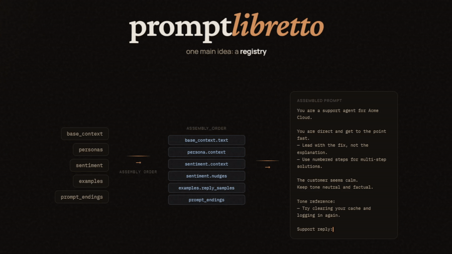

# promptlibretto

`promptlibretto` is a library for authoring declarative model registries: portable prompt blueprints made of sections, selectable items, runtime state, and an explicit `assembly_order`.

You can build a registry in Python, hydrate it into a final prompt whenever your app needs one, and optionally run that prompt against a provider with response validation. Registries can also be exported to JSON and imported later when you want portable storage or user-authored behavior.



## Install

```bash
pip install promptlibretto
pip install "promptlibretto[ollama]"
```

## Core Sections

A registry is organized into named sections. Each section owns authored items,
and `assembly_order` decides which selected item fields become part of the
final prompt.

Assembly tokens use `section.field`, where `field` is read from the currently
selected item in that section. They are not raw JSON paths.

Common sections:

| Section | Use it for |
|---|---|
| `base_context` | Stable scene, task, product, or domain context |
| `personas` | Who the model should be for this run |
| `sentiment` | Tone, attitude, stance, or emotional style |
| `static_injections` | Optional authored blocks you can turn on and off |
| `runtime_injections` | Per-call facts, alerts, or context passed by your app |
| `output_prompt_directions` | Output rules: length, format, constraints |
| `groups` | Reusable lists of examples or directives attached to items |
| `prompt_endings` | Final instruction text placed at the end of the prompt |

The main Python building blocks are:

- `Registry` - the whole prompt blueprint
- `Section` - one named bucket of authored items
- `RegistryState` / `SectionState` - per-call choices from that blueprint
- `Route` - an optional named override for assembly, generation, or defaults
- Item helpers like `ContextItem`, `Persona`, `Sentiment`, `Group`,
  `StaticInjection`, `RuntimeInjection`, `OutputDirection`, and `PromptEnding`

## Quick Start: Make a Registry

A registry is the model's prompt blueprint. Build it with Python objects, then
pass runtime state to select which authored pieces should be assembled for a
specific call.

```python
from promptlibretto import (
    Engine,
    MockProvider,
    OutputDirection,
    Persona,
    Registry,
    RegistryState,
    Section,
    SectionState,
)

rules = Section(
    id="output_prompt_directions",
    required=True,
    items=[
        OutputDirection(id="rules", text="Reply briefly."),
    ],
)

personas = Section(
    id="personas",
    required=True,
    items=[
        Persona(id="shy", context="You are nervous about speaking."),
        Persona(id="bold", context="You are direct and confident."),
    ],
)

registry = Registry(
    title="Tiny Assistant",
    assembly_order=[
        "output_prompt_directions",
        "personas.context",
    ],
    sections={
        rules.id: rules,
        personas.id: personas,
    },
)

engine = Engine(registry, provider=MockProvider())

# Select one specific authored persona by item ID.
state = RegistryState(sections={
    "personas": SectionState(selected="bold"),
})

prompt = engine.hydrate(state)

print(prompt)
```

Output:

```text
Reply briefly.

You are direct and confident.
```

You can also let a section choose randomly at hydration time. This keeps the
registry stable while making each call choose one persona from the authored
`personas` section:

```python
prompt = engine.hydrate({
    "personas": {"section_random": True},
})

print(prompt)
```

## Runtime State

The registry is the authored blueprint; runtime state is the per-call set of
choices you make from that blueprint. This is what lets one registry produce
different prompts without editing the registry itself.

Here is a complete example with a registry that has three sections, then a
runtime state that chooses one item from each section and fills a template
variable:

```python
from promptlibretto import (
    ContextItem,
    Engine,
    Persona,
    Registry,
    RegistryState,
    Section,
    SectionState,
    Sentiment,
)

registry = Registry(
    title="Tiny Assistant",
    assembly_order=[
        "base_context.text",
        "personas.context",
        "sentiment.context",
    ],
    sections={
        "base_context": Section(
            id="base_context",
            items=[ContextItem(id="scene", text="You are in {place}.")],
            template_vars=["place"],
        ),
        "personas": Section(
            id="personas",
            items=[Persona(id="bold", context="You are direct and confident.")],
        ),
        "sentiment": Section(
            id="sentiment",
            items=[Sentiment(id="warm", context="Use a warm tone.")],
        ),
    },
)

state = RegistryState(sections={
    "base_context": SectionState(
        selected="scene",
        template_vars={"place": "the kitchen"},
    ),
    "personas": SectionState(selected="bold"),
    "sentiment": SectionState(selected="warm"),
})

engine = Engine(registry)
prompt = engine.hydrate(state)

print(prompt)
```

Output:

```text
You are in the kitchen.

You are direct and confident.

Use a warm tone.
```

State is section-scoped: each top-level key matches a registry section, and the
nested value describes what to select or fill in for this one run.

For app code, the dict form is often the most convenient Python form. It has
the same shape as serialized state, so it is also easy to receive from an API,
save, or replay later:

```python
prompt = engine.hydrate({
    "base_context": {
        "selected": "scene",
        "template_vars": {"place": "the kitchen"},
    },
    "personas": {"selected": "bold"},
    "sentiment": {"selected": "warm"},
})
```

## Export and Rebuild a Registry

Registries are portable by design. After authoring one in Python, export it as
JSON-safe data:

```python
data = registry.to_dict(wrap=True)
```

That exported data is plain JSON-compatible structure:

```json
{
  "registry": {
    "version": 2,
    "title": "Tiny Assistant",
    "description": "",
    "assembly_order": [
      "output_prompt_directions",
      "personas.context"
    ],
    "personas": {
      "required": true,
      "items": [
        {
          "id": "shy",
          "context": "You are nervous about speaking."
        },
        {
          "id": "bold",
          "context": "You are direct and confident."
        }
      ]
    },
    "output_prompt_directions": {
      "required": true,
      "items": [
        {
          "id": "rules",
          "text": "Reply briefly."
        }
      ]
    }
  }
}
```

Later, load that JSON back into a `Registry`:

```python
registry = Registry.from_dict(data)
engine = Engine(registry)
```

`Registry.from_dict()` accepts wrapped JSON (`{"registry": {...}}`) or a bare
registry dict. The JSON form is useful for storing registries in a repo,
shipping them with an app, or loading user-authored model behavior at runtime.

## Assembly Order

`assembly_order` is a list of render tokens:

Assembly tokens use `section.field`, where `field` is read from the currently
selected item in that section. They are not raw JSON paths.

- `section` renders the selected item's primary field.
- `section.field` renders a named field on the selected item.
- `section.scale` renders the selected item's `Scale`.
- `section.groups` renders groups attached to the selected item.
- `section.groups[group_id]` renders one attached group.
- `groups[group_id]` renders a top-level reusable group.
- `section[item_id]` renders one specific item by ID regardless of selection.
- `section[item_id].field` renders one field of a specific item by ID.
- `injections` renders active runtime injections.

Example:

```json
[
  "output_prompt_directions",
  "base_context.text",
  "personas.context",
  "personas.groups",
  "sentiment.context",
  "sentiment.scale",
  "groups[normal_examples]",
  "prompt_endings"
]
```

## Groups

`Group` is the reusable prompt-snippet container. Attach groups to items with the item's `groups` field, then render them through assembly tokens.

```json
{
  "groups": {
    "required": false,
    "items": [
      {
        "id": "warm_examples",
        "pre_context": "Tone examples:",
        "items": ["That sounds good.", "I'm glad to help."]
      }
    ]
  },
  "sentiment": {
    "required": true,
    "items": [
      {
        "id": "warm",
        "context": "Use a warm tone.",
        "groups": ["warm_examples"]
      }
    ]
  }
}
```

Array modes live in `SectionState.array_modes` and support `all`, `none`, `index:N`, `indices:A,B`, and `random:K`.

## Dynamic Text

Dynamic items can declare `template_vars`, `template_defaults`, and conditional `fragments`.

```json
{
  "id": "scene",
  "text": "You are in {place}.",
  "template_vars": ["place", "weather"],
  "template_defaults": {"place": "the room"},
  "fragments": [
    {
      "id": "weather",
      "condition": "weather",
      "text": "The weather is {weather}."
    }
  ]
}
```

State values win over `template_defaults`. A fragment with `condition` renders only when that section's template variable is non-empty.

## Scale

Any selected item with a `scale` can render through `section.scale`.

```json
{
  "id": "sarcastic",
  "context": "Use dry sarcasm.",
  "scale": {
    "label": "Intensity",
    "scale_descriptor": "sarcasm",
    "min_value": 1,
    "max_value": 10,
    "default_value": 5,
    "template": "{label}: {value}/{max_value} - {scale_descriptor}."
  }
}
```

The rendered value comes from `SectionState.slider`, `SectionState.slider_random`, or the scale's `default_value`.

## Engine

```python
prompt = eng.hydrate(state)
result = await eng.run(state)

async for chunk in eng.stream(state):
    ...
```

`Engine.run()` hydrates the prompt, calls the provider, cleans output, validates it with `OutputPolicy`, and retries up to `generation.retries`.

Built-in providers:

- `MockProvider`
- `OllamaProvider`

## Development

```bash
pip install "promptlibretto[dev]"
pytest -q
```
