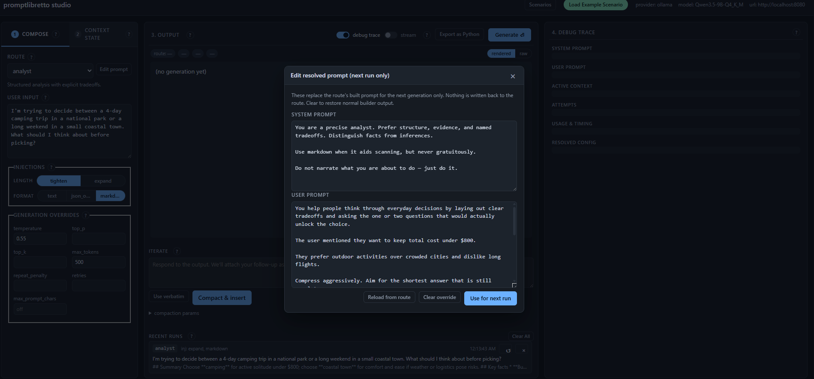

# promptlibretto studio

A browser-based prompt designer for the `promptlibretto` library. Tune
your routes, base context, overlays, and injections against a live model,
then **Export as Python** to drop the exact configuration into your app.


## What you do with it

1. Pick a route. Fill in a user input. Toggle injections and overrides.
2. Generate — inspect the system/user prompts, attempts, and resolved config in the debug trace.
3. Iterate. Follow-ups become overlays; overlays persist across runs.
4. **Edit prompt** (next to the route selector) lets you override the
   resolved system/user text for the next run(s) without touching the
   route. Useful for quickly testing a wording change before deciding
   whether to push it back into the preset. The override sticks until
   explicitly cleared.
5. Hit **Export as Python** → **Copy** the generated `PromptEngine(...)`
   snippet, **Download** it as a `.py` file, or **Save to disk** under a
   name. Saves default to `./promptlibretto_exports/` (the directory you
   launched the studio from), so running the studio from your project
   root drops exports right into the project. Override with
   `PROMPTLIBRETTO_EXPORT_DIR`.

The export is render-time, not structural: it serialises the resolved
state (config, base, overlays, route sections) into runnable code.
Dynamic user-input slots survive as lambdas. If a scenario is loaded,
the export modal prefills the save-name from it.


When you **Save to disk** the studio also snapshots the current state as
a scenario under the same name. The saved-exports list shows a
**Load scenario** button that restores the exact studio setup that
produced the export — edit, then re-export.

### Runtime slots

Each overlay card has a **runtime** dropdown:

- **fixed (set at export time)** — overlay text is baked into the export.
- **runtime — optional** — becomes a keyword arg on the exported
  `async def run(...)`; only set if a non-empty value is passed.
- **runtime — required** — becomes a required keyword arg; the wrapper
  raises `ValueError` if the caller passes an empty string.


Every export ships with an `async def run(user_input="", *, <slots>, **extra)`
helper. `**extra` accepts arbitrary keyword arguments and attaches each
as a priority-10 overlay, so callers can inject ad-hoc context without
re-exporting. The wrapper clears any prior runtime / `**extra` overlays
at entry so calls don't leak state into one another. Runtime-tagged
overlays are also skipped during studio generation (their text is a
design-time placeholder, not a value).

## Running

```bash
pip install "promptlibretto[studio]"
promptlibretto-studio                         # defaults to Ollama at localhost:8080
PROMPT_ENGINE_MOCK=1 promptlibretto-studio    # no model required; echoes prompts
```

Env vars: `HOST`, `PORT`, `OLLAMA_URL`, `OLLAMA_MODEL`, `PROMPT_ENGINE_MOCK`,
`PROMPTLIBRETTO_DATA_DIR` (defaults to `~/.promptlibretto/studio`; holds
scenarios and the base-context library),
`PROMPTLIBRETTO_EXPORT_DIR` (defaults to `./promptlibretto_exports/`;
holds saved `.py` exports — kept in CWD so they sit next to your project).

## Wiring

```
┌────────────── browser (static/app.js) ──────────────┐
│ config · context · routes · injections · runs       │
└───────────────────────┬─────────────────────────────┘
                        │ fetch()
                        ▼
┌────────────── FastAPI (main.py) ────────────────────┐
│ /api/state · /api/generate · /api/context/*         │
│ /api/config · /api/iterate · /api/scenarios         │
│ /api/export                                         │
└───────────────────────┬─────────────────────────────┘
                        │ engine calls
                        ▼
┌────────────── PromptEngine (library) ───────────────┐
│ ContextStore · PromptAssetRegistry · PromptRouter   │
│ Provider · OutputProcessor · RecentOutputMemory     │
│ RunHistory · Middleware                             │
└─────────────────────────────────────────────────────┘
```

One engine is built in `lifespan()` and attached to `app.state`. Handlers
pull it via `_engine()`. The engine owns the context store, router,
provider, recent memory, and run history. The server holds two extra
stores for app concerns the library shouldn't know about.

## Stores

| Store               | Owner     | Purpose                                                 |
| ------------------- | --------- | ------------------------------------------------------- |
| `ContextStore`      | library   | Base text + overlays used to build prompts.             |
| `RecentOutputMemory`| library   | Dedup against near-duplicate outputs (Jaccard).         |
| `RunHistory`        | library   | Ordered log of full runs for replay.                    |
| `BaseLibrary`       | server    | Named, saveable base-context texts.                     |
| `ScenarioLibrary`   | server    | Full app-state snapshots (base + overlays + config).    |
| `ExportLibrary`     | server    | Named `.py` exports saved for copy-paste into your app. |
| `LatencyLogger`     | server    | Middleware-populated ring buffer of run timings.        |

`BaseLibrary` and `ScenarioLibrary` are JSON-backed caches with atomic
tmp-file writes and a lock.

## API shape

- `GET /api/state` dumps config, routes, overlays, injections, recent
  outputs, and run history in one payload. The frontend re-renders from
  this on every meaningful change.
- `POST /api/generate` / `POST /api/generate/stream` run `engine.generate_once`
  or `engine.generate_stream`.
- `POST /api/export` renders the current route + context into a runnable
  Python snippet (uses `promptlibretto.export_python`).
- `GET /api/exports`, `PUT/GET/DELETE /api/exports/{name}` manage saved
  `.py` exports on disk.
- `POST /api/prompt/resolve` runs the builder without calling the
  provider — used by the **Edit prompt** modal to prefill the resolved
  system/user text.
- `POST /api/generate` accepts an optional `section_overrides` body
  field (`{"system": "...", "user": "..."}`) that bypasses the builder
  for one call. The **Edit prompt** button sends this on each generate
  until the user clears the override.
- `PUT /api/context/*`, `PUT /api/config` mutate the engine in place.
- `POST /api/iterate` writes a compacted user follow-up back as a `turn_N`
  overlay via `make_turn_overlay()`.

Handlers don't build prompts; they call engine methods.

## Panels

**Compose tab.** Route selector, user input, injection checkboxes,
generation overrides. **Edit prompt** sits next to the route selector —
opens a modal to override the resolved system / user text for the next
run(s); the override sticks until cleared.




**Context state tab.** Base text at the top, named overlays below with
priority, runtime mode, and expiry. "Suggest" asks the model to propose
overlays against the current base.


**Debug trace panel.** System prompt, user prompt, active context, every
attempt, and the resolved config — live-updated per run.


## Why imperative presets

The router and asset registry are built imperatively in
`presets.py` with `add_frame`, `add_injector`,
`PromptRoute(builder=CompositeBuilder(...))`. Sections are callables,
overrides and output policy are passed through, and builders close over
assets — that expressive surface is already Python, so a YAML schema
would lose expressiveness or reinvent it. Swap `presets.py` for your own
and keep the rest.

## Middleware

`LatencyLogger` in `middleware.py` times each generation
and keeps the last 50 records in a deque, attached at engine construction.
`GET /api/latency` exposes them. Same pattern works for logging, caching,
redaction — any cross-cutting concern that shouldn't touch prompt
construction.

## Scenarios vs run history

Run history answers "what did I send and what came back recently?"
Scenarios answer "snapshot the whole app so I can come back to this
setup." Scenarios are opaque JSON blobs captured and applied by the
browser (`captureScenarioState` / `applyScenarioState` in `app.js`); the
server just persists them by name.

Run history reloads only the original `config_overrides`. The resolved
config lives in each run's metadata so route defaults stay inspectable
and don't become sticky GUI overrides on reload.

## Files

- `main.py` — FastAPI app, lifespan, endpoints.
- `presets.py` — example routes, frames, personas, injectors.
- `middleware.py` — `LatencyLogger`.
- `base_library.py` — named base-context store.
- `scenario_library.py` — named full-state store.
- `export_library.py` — named `.py` export store.
- `static/index.html` — single-page UI.
- `static/app.js` — fetch + render + event wiring.
- `static/style.css` — layout and styling.
